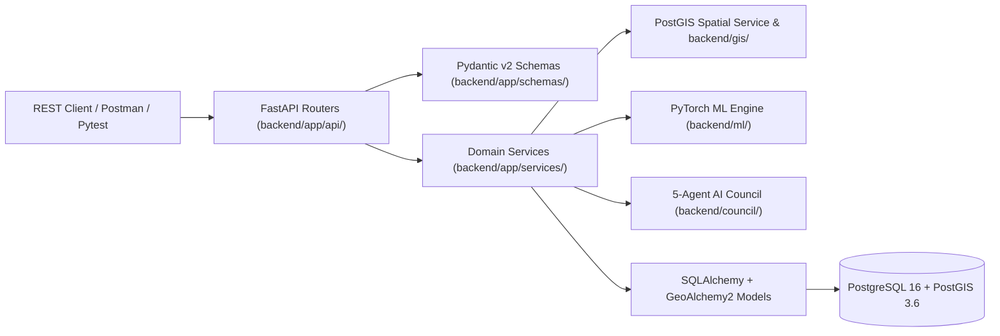

# SIH26012 AeroCadastre — Backend Architecture

## 1. Architectural Overview

AeroCadastre's backend is engineered as a modular, domain-driven **GeoAI Cadastral Intelligence Platform** built on **FastAPI**, **PostgreSQL 16**, **PostGIS 3.6**, **SQLAlchemy 2.0**, **GeoAlchemy2**, **Alembic**, and **PyTorch**.

All spatial geometries, cadastral parcel records, building footprints, road networks, land-use polygons, AI predictions, model training runs, 5-agent AI Council deliberations, topological anomalies, and surveyor verification workflows are persisted in **PostgreSQL + PostGIS** with native `Geometry(GEOMETRY, 4326)` columns and **GIST** spatial indexes.

---

## 2. Directory Layout

```text
D:\SIH26012_AeroCadastre\
├── backend/
│   ├── app/
│   │   ├── main.py                       # FastAPI lifespan, CORS, router registration
│   │   ├── core/
│   │   │   ├── config.py                 # Environment-backed Settings (DATABASE_URL, SECRET_KEY, SRIDs)
│   │   │   ├── database.py               # SQLAlchemy 2.0 Engine, SessionLocal, PostGIS diagnostics
│   │   │   └── security.py               # PBKDF2-HMAC-SHA256 password hashing & JWT bearer auth
│   │   ├── models/
│   │   │   └── entities.py               # 15 core + 7 supporting PostGIS SQLAlchemy ORM models
│   │   ├── schemas/
│   │   │   └── api_schemas.py            # Pydantic v2 request/response schemas & geometry validators
│   │   ├── api/
│   │   │   ├── routes_health.py          # GET /api/health (PostgreSQL + PostGIS live check)
│   │   │   ├── routes_auth.py            # POST /api/auth/login, POST /api/auth/register, GET /api/auth/me
│   │   │   ├── routes_projects.py        # CRUD /api/projects
│   │   │   ├── routes_parcels.py         # CRUD /api/parcels & GET /api/projects/{id}/parcels
│   │   │   ├── routes_buildings_roads.py # GET /api/parcels/{id}/buildings, GET /api/projects/{id}/roads
│   │   │   ├── routes_verification.py    # GET /api/verification/queue, POST/PUT /api/verification
│   │   │   ├── routes_gis.py             # GET /api/parcels/{id}/topology, /conflicts, /api/spatial/nearby
│   │   │   ├── routes_analysis.py        # POST /api/analysis/run, GET /api/analysis/{id}
│   │   │   ├── routes_council.py         # POST /api/council/analyze, GET /api/council/{parcel_id}
│   │   │   ├── routes_exports.py         # POST /api/exports, GET /api/exports/download
│   │   │   └── routes_legacy.py          # /api/dashboard, /api/datasets, /api/scenes/*, /api/copilot/*
│   │   ├── services/
│   │   │   ├── project_service.py        # Project lifecycle & cascade cleanup
│   │   │   ├── parcel_service.py         # Parcel CRUD, versioning, metric area/perimeter calculation
│   │   │   ├── gis_service.py            # Native PostGIS ST_* topology, conflict, & proximity queries
│   │   │   ├── verification_service.py   # Active learning priority queue & surveyor sign-off
│   │   │   ├── ml_service.py             # PyTorch inference orchestration & AIPrediction persistence
│   │   │   ├── council_service.py        # 5-agent AI Council deliberation & CouncilDecision persistence
│   │   │   ├── export_service.py         # GeoJSON, GeoPackage (GPKG), Shapefile ZIP, and CSV exports
│   │   │   └── seed_service.py           # Idempotent synthetic cadastral dataset seeding into PostGIS
│   │   └── utils/
│   │       ├── crs.py                    # EPSG:4326 <-> EPSG:32643 geodesic/UTM transformations
│   │       ├── geojson.py                # Bidirectional GeoJSON / WKT / PostGIS WKBElement conversion
│   │       └── audit.py                  # Immutable AuditLog helper
│   ├── gis/                              # Polygonization, change detection, routing, synthetic GeoTIFFs
│   ├── ml/                               # PyTorch U-Net++, HRNet-OCR, Siamese ChangeNet, calibration
│   ├── council/                          # Multi-agent deliberative reasoning engine
│   ├── copilot/                          # Natural-language GeoAI spatial query assistant
│   └── tests/                            # Pytest suite (test_backend_api.py, conftest.py)
├── alembic/                              # Alembic migration environment & revision scripts
├── alembic.ini                           # Alembic configuration
└── AeroCadastre_Backend.postman_collection.json
```

---

## 3. Separation of Concerns



1. **API Layer (`backend/app/api/`)**: Handles HTTP routing, query parameter parsing, status codes (`200`, `201`, `401`, `404`, `422`), and delegates all business logic to services.
2. **Schema & Validation Layer (`backend/app/schemas/`)**: Validates incoming payloads, enforces WGS84 coordinate bounds (`[-180..180, -90..90]`), validates polygon/linestring geometry types, and rejects self-intersecting or malformed geometries before database persistence.
3. **Service Layer (`backend/app/services/`)**: Orchestrates transactions, computes metric areas (`EPSG:32643`), executes PostGIS spatial SQL queries, runs PyTorch models, invokes the 5-agent AI Council, and records immutable `AuditLog` entries.
4. **Persistence Layer (`backend/app/models/`)**: Maps 22 relational and spatial tables to PostgreSQL + PostGIS using `GeoAlchemy2.Geometry("GEOMETRY", srid=4326, spatial_index=True)` with automatic `WKBElement` normalization hooks.

---

## 4. Coordinate Reference System (CRS) Strategy

- **Storage & API I/O CRS**: `EPSG:4326` (WGS84 longitude/latitude) for seamless GeoJSON compliance (`RFC 7946`).
- **Metric Computation CRS**: `EPSG:32643` (WGS 84 / UTM Zone 43N, meters) for all area (`m²`), perimeter (`m`), overlap area (`m²`), and proximity (`ST_DWithin`) calculations using both native PostGIS `ST_Transform(geom, 32643)` and `pyproj.Transformer`.
