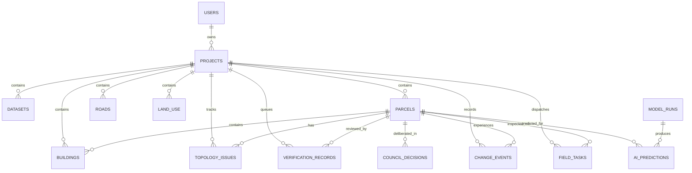

# SIH26012 AeroCadastre — PostgreSQL + PostGIS Database Schema

## 1. Database Engine & Extensions

- **Engine**: PostgreSQL 16.4 (`x86_64-w64-mingw32`)
- **Spatial Extensions**:
  - `postgis` (`3.6.2`) — Geometry/Geography types, GIST spatial indexing, GEOS (`3.14`), PROJ (`8.2.1`)
  - `postgis_topology` (`3.6.2`) — Topological schema support
- **Default Storage SRID**: `4326` (`EPSG:4326`, WGS84)
- **Metric Calculation SRID**: `32643` (`EPSG:32643`, UTM Zone 43N)

---

## 2. Core Tables (15 Required Tables)

| # | Table Name | Primary Key | Spatial Column (`PostGIS`) | Purpose |
|---|---|---|---|---|
| 1 | `users` | `id (VARCHAR)` | — | Authenticated surveyors, revenue officers, and administrators (`PBKDF2` password hashes, role-based access). |
| 2 | `projects` | `id (VARCHAR)` | `bounds_geom GEOMETRY(GEOMETRY, 4326)` | Cadastral resurvey projects with CRS configuration and spatial bounding boxes. |
| 3 | `datasets` | `id (VARCHAR)` | `bounds_geom GEOMETRY(GEOMETRY, 4326)` | Orthophoto GeoTIFFs, legacy cadastral vectors, and uploaded spatial datasets. |
| 4 | `parcels` | `id (VARCHAR)` | `geom GEOMETRY(GEOMETRY, 4326)`, `official_geom GEOMETRY(GEOMETRY, 4326)` | Core land parcel polygons with AI confidence, epistemic uncertainty, metric area/perimeter, official cadastre polygon, and verification status. |
| 5 | `buildings` | `id (VARCHAR)` | `geom GEOMETRY(GEOMETRY, 4326)` | Extracted building footprints linked to `parcels` and `projects`, including roof classification and encroachment area (`m²`). |
| 6 | `roads` | `id (VARCHAR)` | `geom GEOMETRY(GEOMETRY, 4326)`, `centerline_geom GEOMETRY(GEOMETRY, 4326)` | Road corridor polygons and centerlines with width, length, and surface type. |
| 7 | `land_use` | `id (VARCHAR)` | `geom GEOMETRY(GEOMETRY, 4326)` | Land-use classification polygons (`Residential`, `Commercial`, `Agricultural`, `Industrial`, `Institutional`) with NDVI/NDWI indices. |
| 8 | `ai_predictions` | `id (VARCHAR)` | `geom GEOMETRY(GEOMETRY, 4326)` | Individual spatial predictions emitted by ML inference runs (`model_runs`) with confidence, uncertainty, and metrics JSON. |
| 9 | `model_runs` | `id (VARCHAR)` | — | Deep learning training/inference benchmark records (`IoU`, `F1`, `Precision`, `Recall`, `Boundary F1`, `ECE`, `weights_path`). |
| 10 | `council_decisions` | `id (VARCHAR)` | — | Persisted 5-agent AI Council deliberations (`consensus_score`, `risk_score`, `recommended_action`, `agents_json`, `conflict_summary`). |
| 11 | `topology_issues` | `id (VARCHAR)` | `geom GEOMETRY(GEOMETRY, 4326)` | Spatial topology violations detected by PostGIS (`overlap`, `self_intersection`, `cadastre_shift`, `building_encroachment`). |
| 12 | `verification_records` | `id (SERIAL)` | — | Active-learning human-in-the-loop verification queue and surveyor sign-off history (`approved`, `rejected`, `flagged`). |
| 13 | `change_events` | `id (VARCHAR)` | `geom GEOMETRY(GEOMETRY, 4326)` | Bi-temporal (`T1 2022` vs `T2 2025`) change detection polygons (`new_construction`, `boundary_expansion`). |
| 14 | `field_tasks` | `id (VARCHAR)` | `waypoint_geom GEOMETRY(GEOMETRY, 4326)` | Ground-truth GNSS rover inspection tasks assigned to field surveyors. |
| 15 | `audit_logs` | `id (SERIAL)` | — | Immutable system-wide audit trail for all CRUD, AI inference, Council, verification, and export actions. |

---

## 3. Supporting Spatial Tables (7 Tables)

| # | Table Name | Primary Key | Spatial Column (`PostGIS`) | Purpose |
|---|---|---|---|---|
| 16 | `rasters` | `id (SERIAL)` | `bounds_geom GEOMETRY(GEOMETRY, 4326)` | Multi-temporal GeoTIFF raster asset catalog (`t1_2022`, `t2_2025`). |
| 17 | `boundaries` | `id (VARCHAR)` | `geom GEOMETRY(GEOMETRY, 4326)` | Extracted parcel boundary LineStrings with metric uncertainty (`±m`). |
| 18 | `anomalies` | `id (VARCHAR)` | `geom GEOMETRY(GEOMETRY, 4326)` | Ranked cadastral anomaly records for rapid risk visualization. |
| 19 | `field_routes` | `id (VARCHAR)` | `geom GEOMETRY(GEOMETRY, 4326)` | TSP-optimized field survey route LineStrings and ordered waypoints. |
| 20 | `feature_versions` | `id (SERIAL)` | `geom GEOMETRY(GEOMETRY, 4326)` | Historical geometry versioning for Cadastral Time Machine playback. |
| 21 | `evidence` | `id (SERIAL)` | — | Multi-source evidence items attached to parcels (`vision`, `topology`, `temporal`, `cadastre`). |
| 22 | `human_feedback` | `id (SERIAL)` | `original_geom`, `corrected_geom GEOMETRY(GEOMETRY, 4326)` | Active learning geometry corrections submitted by surveyors. |

---

## 4. Entity-Relationship Diagram

---

## 5. Spatial Indexing & PostGIS Queries

Every `Geometry(GEOMETRY, 4326)` column is automatically indexed with a PostgreSQL **GIST** index (`idx_<table>_<column>`) via GeoAlchemy2 (`spatial_index=True`).

Key PostGIS functions executed by `backend/app/services/gis_service.py`:
- `ST_IsValid(geom)` and `ST_IsValidReason(geom)` — OGC topology validity check
- `ST_Area(ST_Transform(geom, 32643))` — Metric area in square meters (`m²`)
- `ST_Perimeter(ST_Transform(geom, 32643))` — Metric perimeter in meters (`m`)
- `ST_Intersects(a.geom, b.geom)` / `ST_Overlaps(a.geom, b.geom)` / `ST_Touches(a.geom, b.geom)` — Neighbor & overlap detection
- `ST_Intersection(a.geom, b.geom)` & `ST_Union(a.geom, b.geom)` — Overlap geometry & cadastre IoU calculation
- `ST_DWithin(ST_Transform(a.geom, 32643), ST_Transform(b.geom, 32643), radius_m)` — Metric proximity search
- `ST_AsGeoJSON(geom)` — Direct database-level GeoJSON serialization
