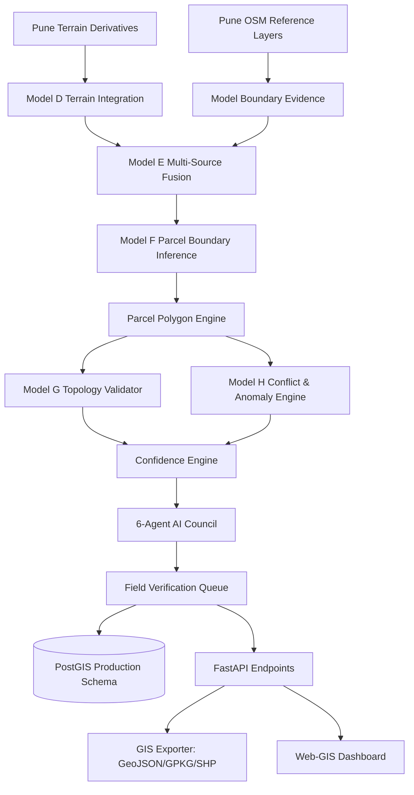

# AeroCadastre Implementation & Audit Status
**Date:** October 3, 2026  
**Document Code:** `docs/IMPLEMENTATION_STATUS_2026-10-03.md`  
**Project Root:** `D:\SIH26012_AeroCadastre`  
**Status:** AUTHORITATIVE AUDIT & ROADMAP  

---

## 1. Executive Summary & Audit State

This document establishes the verified implementation baseline of the AeroCadastre GeoAI cadastral mapping system following the completion of the Pune Common Inference Grid, Model G Topology Engine, Model H Conflict Engine, and Model C Supplementary Land-Use Baseline.

### Completed Foundations:
1. **Model A (Building Detection Benchmark)**: Inria Aerial Image Labeling benchmark trained, ResUNet champion, verified weights and test report. (Pune OSM buildings auxiliary reference only).
2. **Model B (Road Detection Benchmark)**: SpaceNet 3 Paris benchmark trained, ResUNet champion, verified weights, GIS/CRS audit. (Pune OSM roads auxiliary centerline reference only).
3. **Pune Study Area Metric Grid (`EPSG:32643`)**: Standardized 100 m grid (`pune_core_metric_grid_100m`), bounds `[377550.0, 2047000.0, 380750.0, 2049200.0]`, affine transform, and grid GeoTIFFs in `data/real/india/pune/grid/`.
4. **Pune Topographic Derivatives**: 5 physical GeoTIFFs aligned to grid (`pune_core_dem.tif`, `pune_core_slope.tif`, `pune_core_aspect.tif`, `pune_core_relief.tif`, `pune_core_hillshade.tif`).
5. **Auxiliary Reference Layers**: Reprojected Pune OSM buildings and road centerlines (`pune_buildings_utm43n.geojson`, `pune_roads_utm43n.geojson`).
6. **Model G Topology Engine**: Geometric and topological validation engine (`experiments/model_g_topology/`) testing polygon validity, duplicate geometry, overlaps, slivers, gaps, and extreme compactness.
7. **Model H Anomaly & Conflict Engine**: Rule-based conflict engine (`experiments/model_h_anomaly/`) detecting building-road overlap, short road fragments, and isolated buildings.
8. **Model C Supplementary LULC Baseline**: World Bank / ESA EO4SD-Urban Mumbai VHR dataset (`experiments/model_c_lulc/`), strictly marked `SUPPLEMENTARY_ONLY`, `NOT_PUNE_GROUND_TRUTH`, `PUNE_OVERLAP = FALSE`, Random Forest morphological baseline with spatial block cross-validation.
9. **Imagery Status**: Certified as `INDIAN_IMAGERY_STATUS = MISSING` in `data/real/india/pune/imagery/IMAGERY_BLOCKER_REPORT.md`.

---

## 2. Current Blockers & Scientific Boundaries

```
[AUTHENTIC PUNE OPTICAL IMAGERY: MISSING]
   │
   ├── Model A Pune Optical Inference: BLOCKED_BY_IMAGERY_DATA
   ├── Model B Pune Optical Inference: BLOCKED_BY_IMAGERY_DATA
   │
   └── Downstream Production Real-Data Inference:
       ├── Model E Real-Data Fusion: BLOCKED_BY_DEPENDENCY
       └── Model F Real-Data Parcel Boundaries: BLOCKED_BY_DEPENDENCY
```

### Governing Constraints:
- **No Imagery Fabrication**: Synthetic, tile-scraped, or low-resolution proxy images must never be falsely presented as Pune high-resolution optical imagery.
- **Controlled Architectural Unblocking**: To aggressively reduce RED tasks, all downstream modules (Model D terrain, boundary evidence, multi-source fusion, parcel polygonization, confidence, AI council, verification queue, PostGIS schema, and exports) are being implemented using:
  1. Real Pune elevation & terrain layers,
  2. Real Pune OSM building & road reference layers,
  3. Controlled, deterministic synthetic fixtures tagged `DATA_MODE = SYNTHETIC`.

---

## 3. Dependency Graph & Implementation Plan



---

## 4. Execution Sequence

- **Step 1 (Phase 2)**: Model D Terrain Integration (`experiments/model_d_terrain/`)
- **Step 2 (Phase 3)**: Boundary Evidence Engine (`experiments/model_boundary/`)
- **Step 3 (Phase 4)**: Multi-Source Evidence Fusion Engine (`experiments/model_e_fusion/`)
- **Step 4 (Phase 5)**: Parcel Boundary Inference Engine (`experiments/model_f_parcel_inference/`)
- **Step 5 (Phase 6)**: Parcel Polygon Engine (Ring closure, slivers, metrics)
- **Step 6 (Phase 7 & 8)**: Model G Topology & Model H Conflict Upgrades (Repair, Hausdorff, IoU)
- **Step 7 (Phase 9)**: Deterministic Confidence Engine (`experiments/confidence/`)
- **Step 8 (Phase 10 & 11)**: AI Council & Field Verification Priority Queue
- **Step 9 (Phase 12, 13, 14, 15)**: PostGIS Schema, FastAPI API, Security Suite, GIS Exporter
- **Step 10 (Phase 16)**: Synthetic End-to-End Test Suite (`tests/fixtures/synthetic_cadastral/`)
- **Step 11 (Phase 17, 18, 19, 20, 21)**: Web-GIS, Human-in-the-loop structures, Master Registries, Full Regression, and Final RED Task Reduction Report.
